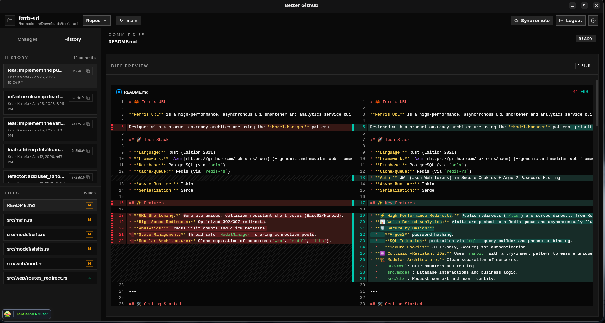

# better-github

desktop git workspace for managing local repositories with github auth and tauri-native commands.



## what you can do

- connect with github device flow or manual token
- open and track multiple local repos in one app session
- switch active repo from the header repo picker
- remove a repo from the viewed list with confirmation
- inspect file changes, diffs, and commit history
- stage/unstage changes, commit, branch, merge, fetch, and push
- logout and clear current auth session

## tech stack

- bun workspaces + turborepo
- react 19 + typescript
- tanstack router + tanstack query
- tailwindcss + base-ui + shadcn-style components
- tauri v2 + rust + git2
- oxlint + oxfmt

## project structure

```text
better-github/
├── apps/
│   └── desktop/        # tauri desktop app (react frontend + rust backend)
└── packages/
    ├── config/         # shared tsconfig and tooling presets
    └── env/            # shared env parsing/helpers
```

## getting started

```bash
bun install
```

run all workspace dev pipelines:

```bash
bun run dev
```

run desktop app only:

```bash
cd apps/desktop
bun run desktop:dev
```

## scripts

from repo root:

- `bun run dev` - run turbo dev pipelines
- `bun run build` - run workspace builds
- `bun run check-types` - run type checks across workspaces
- `bun run check` - run oxlint and format with oxfmt

from `apps/desktop`:

- `bun run dev` - run vite frontend dev server
- `bun run desktop:dev` - run tauri desktop app in development
- `bun run desktop:build` - build production desktop binaries
- `bun run check-types` - type-check desktop app
